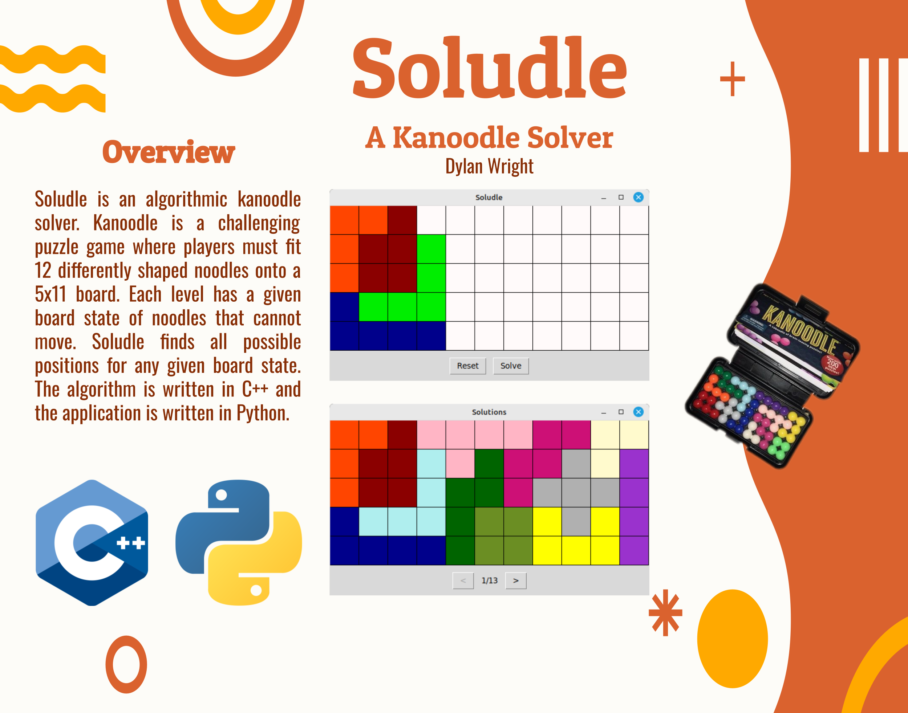
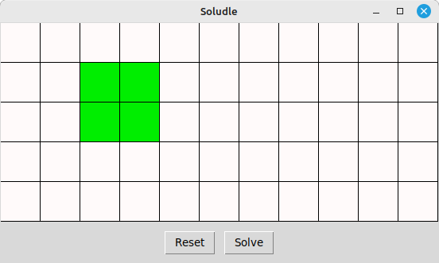
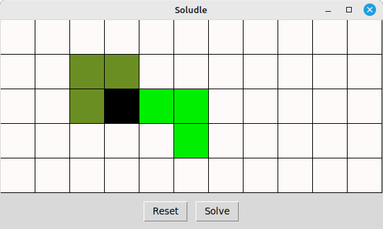
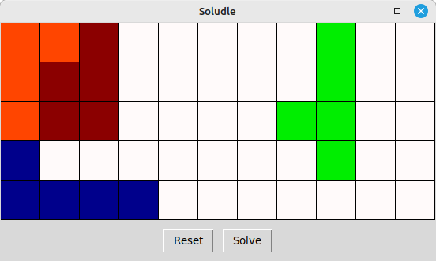
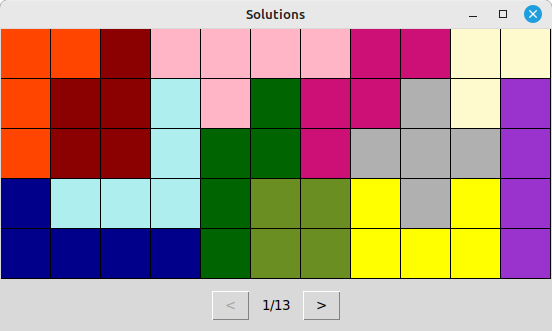
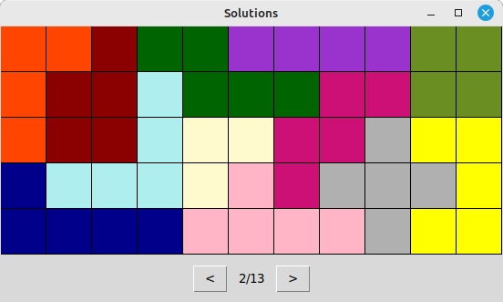

To run the program, make sure you make the project using the provided makefile:
```
make
```

Then, you can run the gui to play Kanoodle:
```
python soludle.py
```

The lime green squares are the piece currently being placed.


The noodle can be moved with the arrow keys. `R` rotates the noodle. `Y` reflects it. `Space` will switch to the next noodle. You can press `Enter` to place the piece on the board. Black squares indicate that the noodle you are trying to place is covering a noodle that is set on the board.


The reset button can be used to reset the board. Once you've finished placing noodles on the board, you can use the solve button to generate all solutions given the noodles you set on the board can't move.


